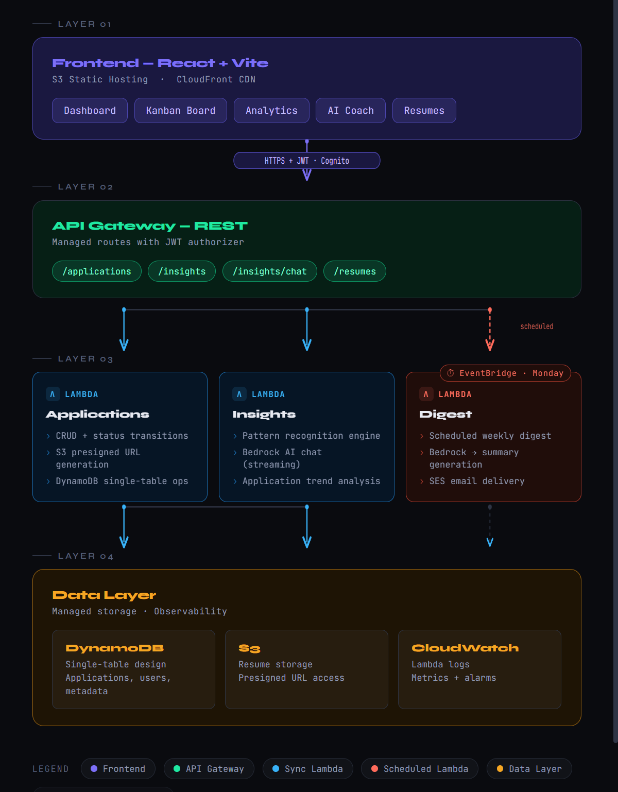

# Applytic

> AI-powered job application tracker that learns from your rejections.

**Live demo:** https://d3jumje9o63lys.cloudfront.net

Applytic tracks every job application you submit, detects patterns across rejections (which resume version converts best, which source channel works, which company sizes respond), and uses Amazon Bedrock (Claude) to turn that data into actionable coaching — delivered as a chat interface and a weekly email digest.

Built as a production-grade portfolio project to demonstrate end-to-end AWS ML engineering.

---

## Architecture



---

## Tech Stack

| Layer | Service |
|---|---|
| Frontend | React 18, TypeScript, Vite, Tailwind CSS |
| Auth | Amazon Cognito (email + JWT) |
| API | API Gateway REST + Lambda (Python 3.12, ARM64) |
| AI / ML | Amazon Bedrock — Claude 3.5 Sonnet |
| Database | DynamoDB — single-table design, PAY_PER_REQUEST |
| Storage | S3 — resume versioning + frontend hosting |
| CDN | CloudFront |
| Scheduling | EventBridge cron (Monday 8am UTC) |
| Email | Amazon SES |
| IaC | AWS CDK v2 (TypeScript) |
| CI/CD | GitHub Actions |

---

## Features

**Application tracking**
- Log applications with company, role, source, resume version, company size, job description URL
- Kanban board with drag-and-drop status updates (Applied → Screened → Interview → Offer / Rejected)
- Click any card to view full detail, edit fields, or see status timeline
- Search by company/role, filter by source channel

**AI insight engine**
- Pattern analysis across 6 dimensions: source channel, company size, resume version, role seniority, weekly velocity, status funnel
- Response rate computed per bucket — shows exactly which resume version or source is working
- AI coaching chat powered by Bedrock Claude — answers questions like "why am I getting ghosted?" using your actual data as context
- Weekly email digest every Monday with stats + one AI-generated tip

**Resume version tracker**
- Upload multiple PDF versions to S3 via presigned URLs
- Tag each application with the resume version used
- Analytics shows conversion rate per version side-by-side

---

## Project Structure

```
applytic/
├── cdk/                    # AWS CDK stack — all infrastructure
│   ├── bin/app.ts
│   └── lib/applytic-stack.ts
├── lambdas/                # Python Lambda handlers
│   ├── applications/       # CRUD + presigned URL
│   ├── insights/           # Pattern analysis + Bedrock chat
│   └── digest/             # Weekly SES email digest
├── frontend/               # React + Vite app
│   └── src/
│       ├── components/
│       ├── hooks/
│       ├── lib/
│       ├── pages/
│       └── types/
├── tests/                  # Pytest unit tests
├── scripts/                # Seed data utilities
└── .github/workflows/      # GitHub Actions CI/CD
```

---

## DynamoDB Single-Table Design

| Entity | PK | SK | GSI1PK | GSI1SK |
|---|---|---|---|---|
| Application | `USER#userId` | `APP#appId` | `USER#userId` | `DATE#timestamp` |
| Status event | `APP#appId` | `EVENT#timestamp` | — | — |

**Access patterns:**
- List all applications for a user → GSI1 query on `USER#userId`, sorted by date
- Get single application → Main table get on `USER#userId` + `APP#appId`
- Get status history for an app → Main table query on `APP#appId` with `EVENT#` prefix

---

## Local Setup

### Prerequisites
- Node.js 18+
- Python 3.12
- AWS CLI configured (`aws configure`)
- AWS CDK CLI: `npm install -g aws-cdk`

### Deploy backend
```bash
cd cdk
npm install
cdk bootstrap
cdk deploy
```

Save the outputs — you'll need `ApiUrl`, `UserPoolId`, `UserPoolClientId` for the frontend.

### Run frontend locally
```bash
cd frontend
cp .env.example .env
# fill in .env with CDK outputs
npm install
npm run dev
```

Opens at `http://localhost:5173`

### Deploy frontend
```bash
cd frontend
npm run build
aws s3 sync dist/ s3://applytic-frontend-YOUR_ACCOUNT_ID --delete
aws cloudfront create-invalidation --distribution-id YOUR_DIST_ID --paths "/*"
```

### Seed demo data
```bash
cd scripts
pip install boto3
python seed_data.py --user-id YOUR_COGNITO_SUB
```

---

## Environment Variables

| Variable | Description |
|---|---|
| `VITE_API_URL` | API Gateway base URL from CDK output |
| `VITE_USER_POOL_ID` | Cognito User Pool ID |
| `VITE_USER_POOL_CLIENT_ID` | Cognito App Client ID |
| `VITE_AWS_REGION` | AWS region (us-east-1) |

---

## Key Engineering Decisions

**Single-table DynamoDB** — all entities in one table with composite keys. Avoids joins, scales to any load, and demonstrates understanding of NoSQL access pattern design rather than SQL-in-NoSQL thinking.

**Pattern analysis before LLM** — the insights Lambda computes structured metrics (response rates per bucket) before calling Bedrock. The LLM gets hard numbers as context, not raw application data — this makes the coaching specific and data-driven rather than generic.

**Serverless-first** — no EC2, no containers. Lambda + API Gateway + DynamoDB means near-zero cost at low volume and automatic scaling. EventBridge replaces a cron server entirely.

**ARM64 Lambda** — all functions run on Graviton2 (ARM64) for ~20% cost reduction and faster cold starts vs x86.

**Resume versioning** — S3 object versioning + tagging each application with a resume version name enables A/B analysis of resume performance over time — a feature no off-the-shelf tracker offers.

---

## AWS Services Used

`Lambda` `API Gateway` `DynamoDB` `S3` `CloudFront` `Cognito` `Bedrock` `SES` `EventBridge` `CloudWatch` `IAM` `CDK`

---

## Author

**Hardik** — [github.com/hardikjp7](https://github.com/hardikjp7)
